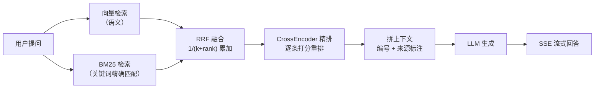
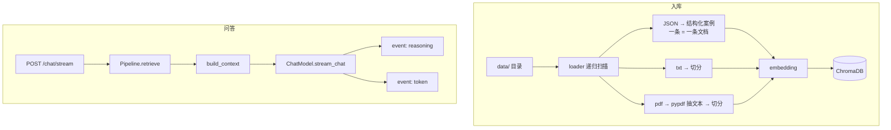
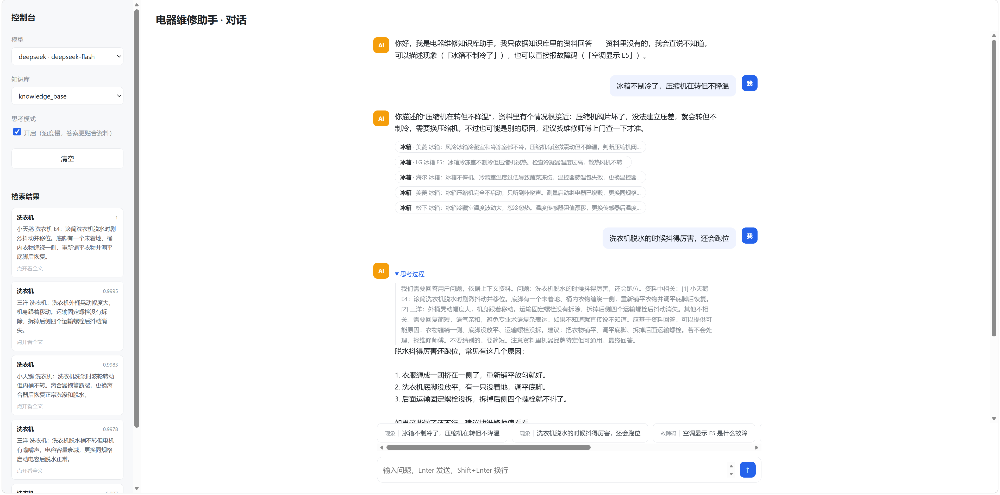

<div align="center">

# rag-bot 知识问答助手

**基于 FastAPI / ChromaDB / LangChain 构建的 RAG 问答机器人。检索采用四段串联——向量（语义）+ BM25（关键词）→ RRF 融合 → CrossEncoder 精排，支持多知识库切换、多模型切换与思考模式，并内置离线评测用于量化检索效果。**

[](https://www.python.org/) &nbsp;   

</div>

---

## 📖 项目简介

本项目以RAG对话为主场景：后端用 FastAPI 提供接口，检索侧把向量检索和 BM25 关键词检索的结果做 RRF 融合、再用 CrossEncoder 精排，最后交给 LLM 生成回答并以 SSE 流式返回。前端内置一个聊天页，方便直接调试。

系统包含以下能力：

- **四段混合检索**：向量认语义、BM25 认字面，两者互补——像 `E4`、`UE` 这种故障码向量几乎无感，靠 BM25 精确命中
- **多知识库**：每个库是独立的 ChromaDB collection，请求时可指定
- **多模型切换**：DeepSeek 与本地 Ollama 都支持，每个请求都能切，还能开关思考模式
- **三种格式入库**：结构化 JSON / 纯文本 / PDF，首次启动自动建库并引导入库
- **离线评测**：228 条测试集，对比不同检索配置的命中率与排名质量
- **SSE 流式**：回答逐段推送，思考过程单独成一类事件

## 🧱 项目结构

```text
rag_base_demo/
├── main.py                 # FastAPI 入口：lifespan（引导 + 预热）、CORS、挂路由
├── config/                 # 配置：加载 .env、解析项目根路径
├── utils/                  # 项目根路径解析（与当前工作目录无关）
├── rag/
│   ├── vector_store.py     # 向量库封装：多库管理 + CRUD + 库名校验
│   ├── bm25_retriever.py   # BM25 关键词检索（jieba 分词 + rank-bm25）
│   ├── fusion.py           # RRF 倒数排名融合
│   ├── reranker.py         # CrossEncoder 精排
│   ├── generator.py        # LLM 封装：双 provider + 思考开关
│   └── pipeline.py         # 编排：四段检索 → 拼上下文 → 生成
├── ingestion/              # 入库：三种格式 + 首次启动引导
├── api/                    # service（业务编排）+ routes（HTTP 路由）
├── prompts/                # 提示词模板
├── static/                 # 内置聊天页
├── evaluation/             # 评测集与跑分脚本
├── scripts/                # 命令行入库
└── data/                   # 待入库的 json / txt / pdf（含示例数据）
```

## ✨ 主要特性

| 特性 | 说明 |
| --- | --- |
| 四段混合检索 | 向量 + BM25 → RRF 融合 → CrossEncoder 精排，逐层提纯 |
| RRF 融合 | 只看名次不看分数，所以向量距离和 BM25 分数量纲不同也能融 |
| CrossEncoder 精排 | Qwen3-Reranker 对候选逐条打分重排，实测把 hit@3 从 93% 提到 99% |
| 多知识库 | 库名即 ChromaDB collection，可建可删可列，带名称合法性校验 |
| 多模型 | DeepSeek API / 本地 Ollama，前端可逐请求切换 |
| 思考模式 | 可开关推理模型（`deepseek-flash` / `qwen3.5`）的思考过程，思考内容单独流式下发 |
| 三种入库链 | 结构化 JSON / 纯文本 / PDF，按后缀自动分发 |
| 离线评测 | 228 条测试集（200 语义 + 28 故障码），对比三种检索配置 |

## 🏗️ 检索架构



四段的意义在于**互补**：向量检索认语义但对方言/专有名词不敏感；BM25 认字面但不懂同义改写。RRF 用名次把两路结果合并（不需要校准分数），精排再用交叉编码器对候选逐条精算，把真正相关的顶上来。

开销集中在精排——实测向量 + BM25 + RRF 只要 **26ms**，加上精排变成 **900ms 以上**（CPU）。

## 🔄 数据流



## 🧰 技术栈

- **Python 3.10**
- **FastAPI + Uvicorn** —— HTTP 接口与 SSE 流式
- **ChromaDB** —— 向量库，多 collection 承载多知识库
- **LangChain** —— 模型接入层（`init_chat_model` 分发到各 provider）
- **rank-bm25 + jieba** —— 中文关键词检索
- **sentence-transformers** —— CrossEncoder 精排
- **Ollama** —— 本地 embedding（`qwen3-embedding:8b`）与本地对话模型
- **DeepSeek API** —— 云端对话模型
- **pypdf** —— PDF 文本抽取

## 🧭 功能说明

### 💬 问答能力

- 单轮问答，支持一次性返回（`/chat`）和流式返回（`/chat/stream`）
- 流式回答下方展示引用来源（来自检索命中的 `source` / `category`）
- 开启思考模式后，模型的思考过程单独成一类事件下发，前端可折叠查看
- 内置聊天页：左栏切模型 / 知识库 / 思考开关，底部有示例问题可直接点

### 📚 知识库能力

- `ingest_structured`：结构化 JSON，一条记录直接入库不切分
- `ingest_text`：纯文本，递归字符切分
- `ingest_pdf`：PDF，先用 pypdf 抽文本再切分
- 首次启动自动引导：默认库不存在则建库并把 `data/` 下所有文件入库；已存在则跳过
- 库名带合法性校验（3~512 字符、只允许 `[a-zA-Z0-9._-]`、不支持中文），报错信息可读

### 🔍 检索能力

- 向量与 BM25 各取 20 条候选 → RRF 融合 → 取前 10 条送精排 → 返回前 5 条
- 精排可选：`RERANKER_PATH` 留空则跳过，延迟降到 ~26ms
- 入库后自动失效 BM25 索引缓存，避免检索到旧数据

### 🤖 模型能力

- DeepSeek 和 Ollama 两个 provider，通过 `init_chat_model` 按名字分发
- 模型列表由 `.env` 决定：配了哪个就出现哪个，没配的不出现
- 思考开关两个 provider 机制不同（DeepSeek 用 `extra_body.thinking.type`，Ollama 用 `reasoning`），实例按 `(模型, 开关)` 分别缓存

### 📊 评测能力

- 228 条测试集，分两类各测一种能力：
  - `sym-*`（200 条）**语义类** —— LLM 把案例现象改写成用户口吻的提问，不提品牌和故障码
  - `code-*`（28 条）**故障码类** —— 「格力空调显示 E5」这种，测 BM25 的字面精确匹配
- 对比三种配置的 `hit@3` / `hit@5` / `MRR` / 耗时
- `dataset.jsonl` 已随仓库提交，跑评测**不需要**再调 LLM

## 🚀 快速开始

### 1️⃣ 安装依赖

```bash
pip install -r requirements.txt
```

### 2️⃣ 拉取模型并配置
embedding模型与rerank模型都推荐使用千问的模型，效果更好

需要本地 Ollama 在运行（embedding 用）或者拉取使用本地模型亦可：

```bash
ollama pull batiai/qwen3-embedding:0.6b      # 非必需：embedding也可以使用本地模型（需要在env中配置好本地模型路径）
ollama pull qwen3.5:2b              # 可选：想用本地对话模型才需要
```

复制配置模板并填写：

```bash
cp .env.example .env
```

至少需要填 `OLLAMA_EMBEDDING_MODEL`（或 `EMBEDDING_MODEL_PATH`）和 `DEEPSEEK_API_KEY`。
想让 Ollama 的对话模型出现在前端下拉框里，还要填 `OLLAMA_CHAT_MODEL`——**没填就不会出现**。

### 3️⃣ 准备数据

把待入库的 json / txt / pdf 放进 `data/` 目录（支持子目录，会递归扫描）。

**仓库自带一份电器维修示例数据**，clone 下来就能直接跑：

| 文件 | 说明 |
| --- | --- |
| `data/维修手册.txt` | 常见家电故障与维修常识 |
| `data/安全规范.pdf` | 维修安全操作规范 |
| `data/故障案例.json` | 200 条结构化案例，带分类 / 品牌 / 故障码 / 难度 / 费用 / 保修 元数据 |

### 4️⃣ 启动服务

```bash
uvicorn main:app --reload --port 8000
```

首次启动会自动建库并入库（约 1 分钟，取决于文件量）。

### 5️⃣ 运行评测

```bash
python evaluation/run_eval.py            # 跑评测
python evaluation/run_eval.py --rebuild  # 语料变了之后先删库重建
```

## 🖥️ 使用方式



启动后打开 **`http://127.0.0.1:8000/`**：

1. 左栏选择**模型**（没有可选的就检查 `.env` 里 `OLLAMA_CHAT_MODEL` 是否填了）
2. 选择**知识库**
3. 需要更强的推理时勾上**思考模式**（速度会明显变慢）
4. 在输入框提问，或直接点底部的示例问题
5. 回答下方会列出**引用来源**；开了思考模式还能展开看**思考过程**

`http://127.0.0.1:8000/docs` 是 FastAPI 自动生成的交互式 API 文档。

## ⚙️ 环境变量

| 变量 | 说明 | 默认值 |
| --- | --- | --- |
| `DEEPSEEK_API_KEY` | DeepSeek API 密钥 | 无 |
| `DEEPSEEK_MODEL` | DeepSeek 对话模型 | `deepseek-flash` |
| `OLLAMA_BASE_URL` | Ollama 服务地址 | `http://localhost:11434` |
| `OLLAMA_CHAT_MODEL` | Ollama 对话模型。**填了才会出现 Ollama 选项** | 空 |
| `OLLAMA_EMBEDDING_MODEL` | Ollama embedding 模型名 | 空 |
| `EMBEDDING_MODEL_PATH` | 本地 SentenceTransformer 模型路径 | 空 |
| `CHROMA_PATH` | 向量库持久化目录 | `<项目根>/chroma_db` |
| `COLLECTION_NAME` | 默认知识库名 | `knowledge_base` |
| `DATA_DIR` | 源文件目录 | `<项目根>/data` |
| `RERANKER_PATH` | CrossEncoder 精排模型路径。留空则跳过精排 | 空 |

`OLLAMA_EMBEDDING_MODEL` 与 `EMBEDDING_MODEL_PATH` 二选一；两者都配置时优先使用 Ollama。这两个值在**启动时读取一次**，运行期间固定不变——**换 embedding 模型等于换向量维度，必须重建库**。

## 🔌 接口

| 方法 | 路径 | 说明 |
| --- | --- | --- |
| GET | `/models` | 可选的对话模型 |
| GET | `/collections` | 可选的知识库 |
| POST | `/chat` | 一次性问答，返回 JSON |
| POST | `/chat/stream` | 流式问答（SSE） |

请求体（除 `query` 外都可选）：

```json
{
  "query": "冰箱不制冷怎么修",
  "model_id": "ollama:qwen3.5:2b",
  "reasoning": false,
  "collection": "knowledge_base",
  "top_n": 5
}
```

`/chat/stream` 的 SSE 事件：

```
sources     引用来源列表，先发（前端可以先渲染引用）
reasoning   思考过程的片段。只在 reasoning=true 时出现，可能很多条，且会和 token 交错
token       正文片段，逐段流
done        结束
error       出错。出错时发这个事件而不是 HTTP 状态码——流一旦开始推送，状态码就改不了了
```

## 📊 评测结果

```
配置                  hit@3    hit@5      MRR       ms
① 纯向量              93.0%    94.7%   0.9004       32
② 向量+BM25+RRF       93.4%    96.5%   0.8888       33
③ 全量（+rerank）        99.1%    99.6%   0.9740      915

按时类型拆分（hit@3）:
                语义类      故障码类
① 纯向量         92.0%      100%
② 融合           92.5%      100%
③ 全量           99.0%      100%
```


## ⚠️ 已知限制

- **检索延迟约 1 秒**（CPU，实测波动在 0.9~1.4 秒之间）。精排占了绝大部分——向量 + BM25 + RRF 只要 26ms，精排每条约 150~180ms，耗时正比于候选数 × 文档长度。
- **rerank模型常驻内存约 1.7 GB**（CPU-only 的 torch 构建，占的是内存不是显存）。
- **只支持单轮问答**。问「那第二个呢？」会检索不到——这句话里没有可检索的实体。
- **PDF 切分丢页码**，做不了「见第 3 页」这种引用。
- **结构化 JSON 入库不写 `source` 字段**，没法按「来源文件」整批删除。
- **库名不支持中文**（ChromaDB 的硬性约束）+ 长度限制 3~512。

## 🗺️ 后续计划

### 功能

- **多轮对话** —— 不是把历史拼进 prompt 就完事，得在检索前加一步 query 改写（把「那洗衣机呢」+ 历史改写成「洗衣机常见故障」），否则检索那一步就废了。或者是改造成agent，让agent自主判断搜索
- **文件上传接口** —— 现在只能把文件丢进 `data/` 目录再跑脚本，用户侧用不了。
- **正文内引用** —— 前端已展示来源标签，但模型还不会在正文里标注 `[1]`。


### 生产化

- **认证与限流** —— 目前任何人都能调，每次调用都在烧 API 额度。

### 评测

- 测试集是 LLM 合成的，不是真实用户提问，分数会偏高
- 每个问题只有一条标准答案，指标应看作下界
- 只测了检索，没测生成层（答案准不准、有没有编）
